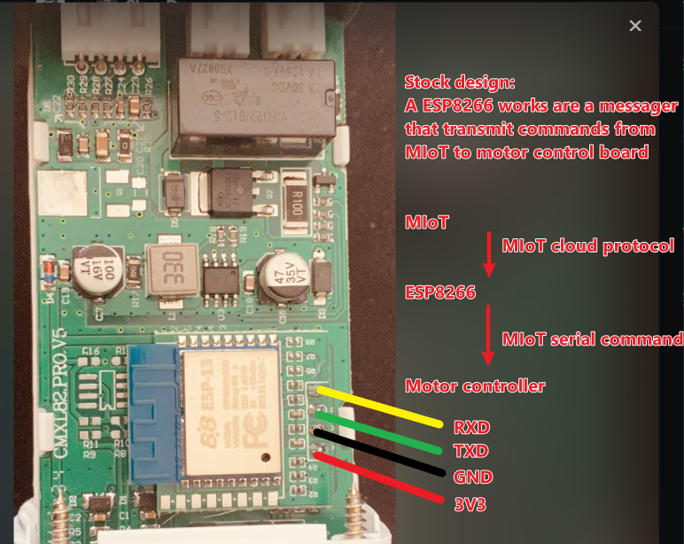
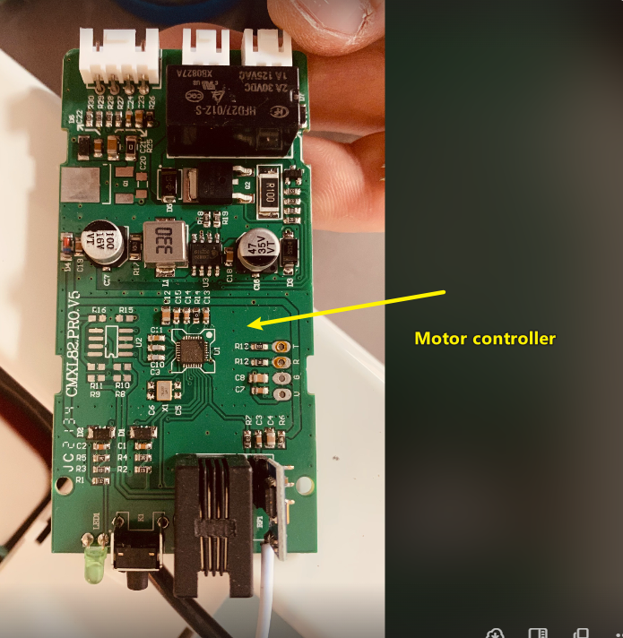
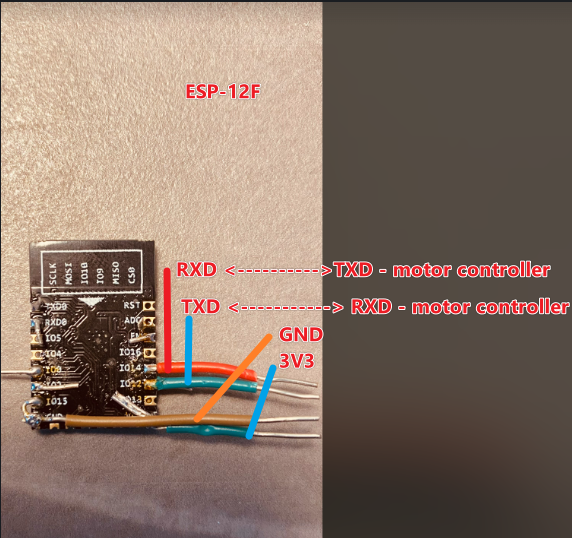

# xiaomi curtain esphome integration (offline version)
This is an offline version of xiaomi curtain. It uses native esphome [custom cover component](https://esphome.io/components/cover/custom.html) so it does not rely on any xiaomi IoT environment.

## Model
My curtain motor model is [babai.curtain.190812](https://home.miot-spec.com/s/babai.curtain.190812). The protocol is [xiaomi](https://www.mi.com/en/documents/product/appendix/protocol/xiaomi-protocol.html).

## Principal
The curtain motor is controller by sending serial commands to control the motor. The commands can be sniffed by serial monitor, they are defined in [protocol.md](protocol.md).
Then we can use another esp board to control the motor using these commands with esphome, so that we can use hass to control the motor without Miot.

## Installation
1. Take the board out of the shell.

2. Solder the stock board off the motor controller.

3. Flash the binary onto a new esp board. I choose to keep the stock board in case I would like to switch back in the future.

4. Install the new esp core to the motor controller.

## Known Problem
[ ] The curtain is not stable on responding to the command. Sometimes the curtain does not open/close on requesting unless retrying from home assistant.
[ ] The position move is not stable.

All these are due to the motor controller not respect the command sent by the esp board reliablely.

## Reference
- [miot 云端交互指令](https://iot.mi.com/new/doc/embedded-development/wifi/rpc)
- [miot 串口指令](https://iot.mi.com/new/doc/embedded-development/wifi/module-dev/serial-communication#%E4%B8%B2%E5%8F%A3%E6%8C%87%E4%BB%A4%E8%A7%84%E5%88%99)
- [Xiaomi Miot Serial Communication](https://github.com/blakadder/miot)
- [esphome custom cover component](https://esphome.io/components/cover/custom.html) 
- [esphome-tuya-curtain](https://github.com/iphong/esphome-tuya-curtain)